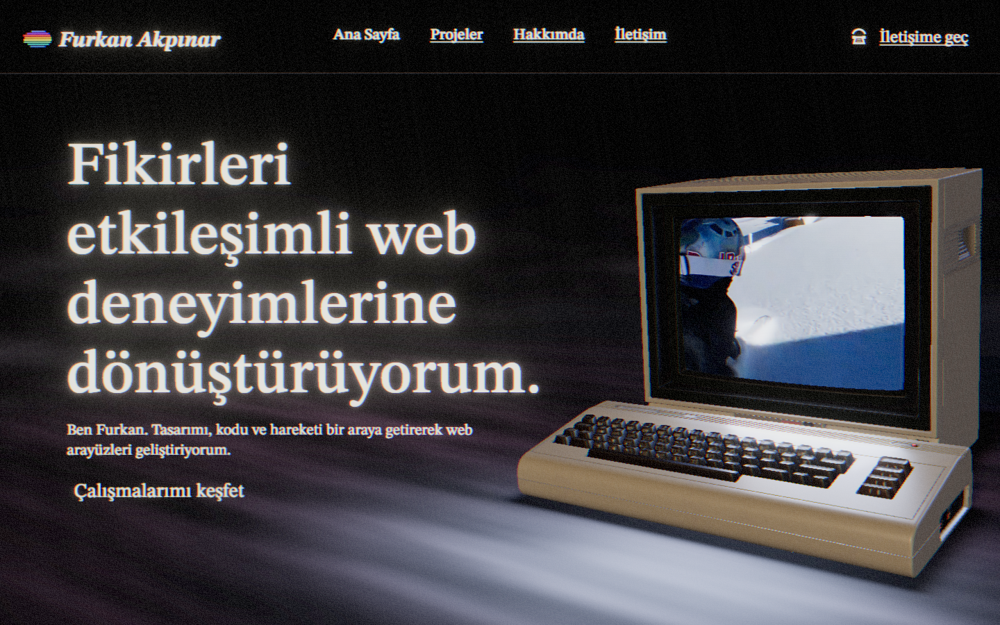
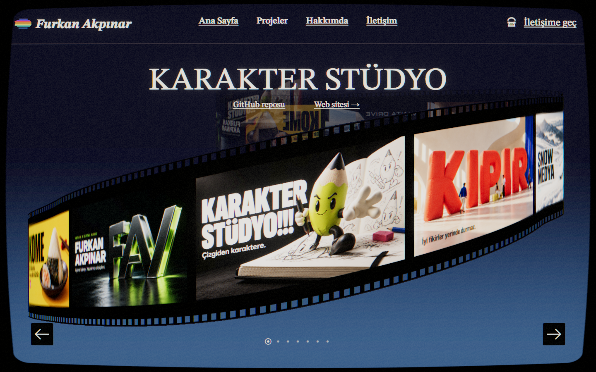
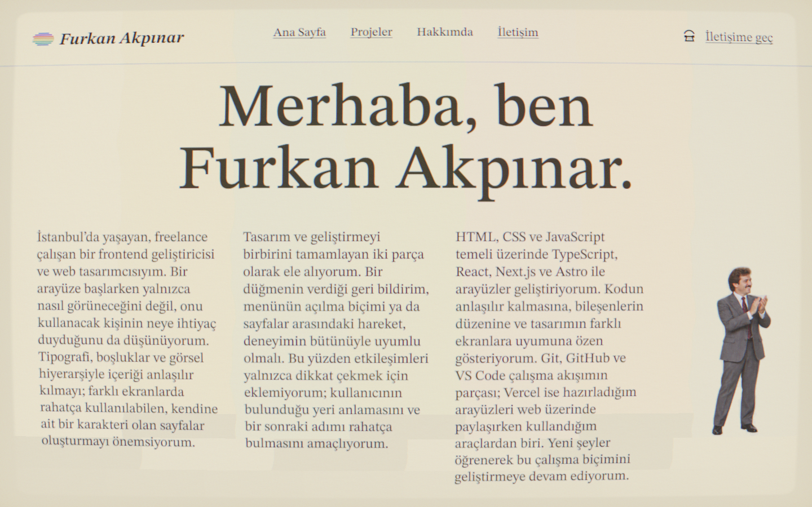
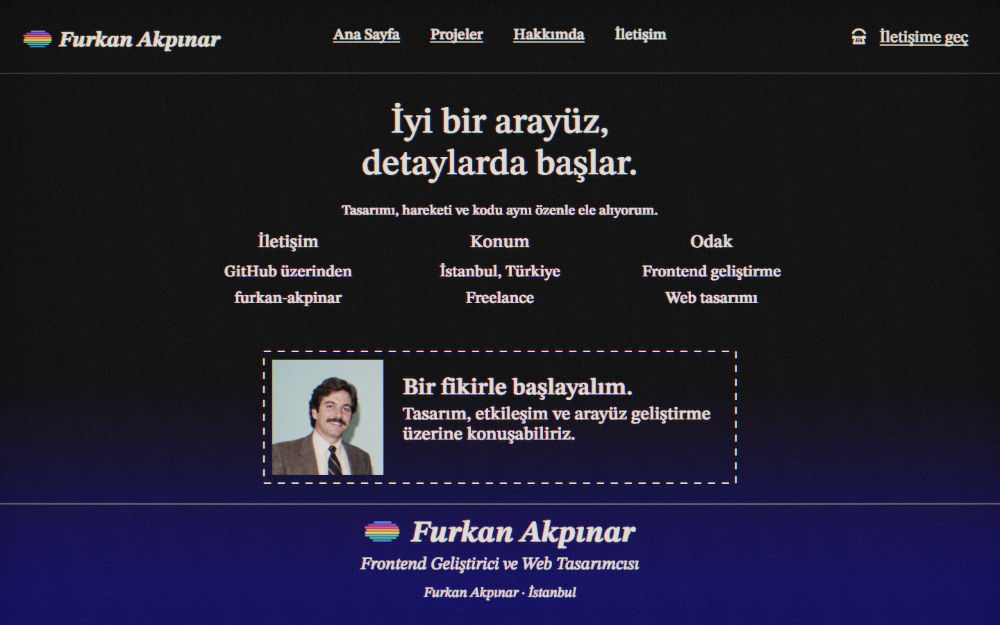
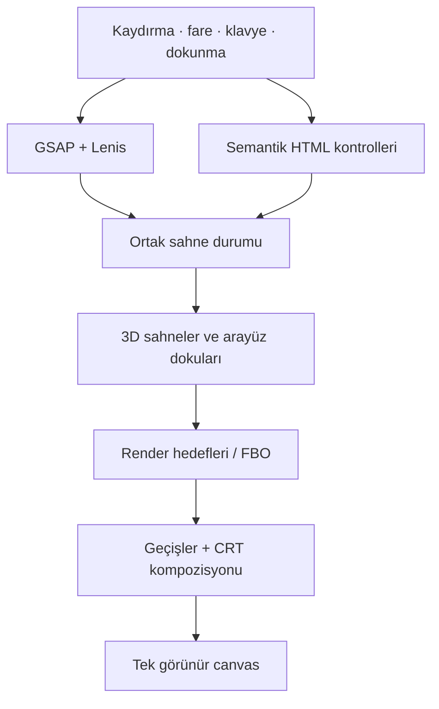

# Furkan Akpınar — Interactive Portfolio

Frontend geliştirme ve web tasarımı çalışmalarımı, etkileşimli bir CRT ekran deneyimi içinde sunan kişisel portföyüm. Üç boyutlu bilgisayar sahnesi, kesintisiz proje filmi, hareketli tipografi ve kaydırmaya bağlı geçişler aynı görsel dünyada buluşuyor.

[**Canlı site ↗**](https://furkanakpinar.dev/) · [**Kaynak kod**](https://github.com/furkan-akpinar/furkan-akpinar-crt-portfolio) · [**GitHub profilim**](https://github.com/furkan-akpinar)




| Projeler | Hakkımda | İletişim |
| :---: | :---: | :---: |
|  |  |  |

## İçindekiler

- [Deneyim](#deneyim)
- [Teknolojiler](#teknolojiler)
- [Görüntüleme mimarisi](#görüntüleme-mimarisi)
- [Teknik seçimler](#teknik-seçimler)
- [Etkileşim ve erişilebilirlik](#etkileşim-ve-erişilebilirlik)
- [Yerelde çalıştırma](#yerelde-çalıştırma)
- [Komutlar ve doğrulama](#komutlar-ve-doğrulama)
- [Cloudflare üzerinde yayınlama](#cloudflare-üzerinde-yayınlama)
- [Proje yapısı](#proje-yapısı)
- [İçeriği düzenleme](#içeriği-düzenleme)
- [Varlıklar ve atıflar](#varlıklar-ve-atıflar)
- [İletişim](#iletişim)

## Deneyim

Portföy dört ana bölümden oluşur. Bölümler arasındaki hareket, kaydırma konumuna bağlı ortak bir sahne akışı üzerinden ilerler.

| Bölüm | Deneyim |
| --- | --- |
| **Ana Sayfa** | Animasyonlu açılış, Commodore bilgisayar modeli, kavisli monitörde kısa videolar, ekran renklerine tepki veren ışık ve hafif kamera parallax’ı. |
| **Projeler** | Derinlikten gelen S biçimli film, tekrar eden yedi proje posteri, aktif kartla birlikte hareket eden başlık ve ayrı GitHub / web sitesi bağlantıları. |
| **Hakkımda** | Türkçe kişisel anlatım, kullanılan teknolojiler, CRT görünümünü koruyan tipografi ve kaydırmayla kıvrılan sayfa. |
| **İletişim** | Mavi zemin üzerinde kapanış mesajı, iletişim bilgileri, çalışma odağı ve GitHub üzerinden ulaşılabilen davet alanı. |

Ana Sayfa ile Projeler arasında kamera monitöre yaklaşır; proje sahnesi ekranın içinden devam eder. Projelerden Hakkımda’ya geçerken merkezden genişleyen parlak bir açıklık kullanılır. Diğer menü geçişlerinde kısa bir sinyal kaybı animasyonu iki bölüm arasındaki değişimi örter.

## Teknolojiler

| Katman | Teknoloji | Kullanımı |
| --- | --- | --- |
| Uygulama | **Next.js 16.3.8** | App Router, metadata, istemci bileşenleri ve statik dışa aktarım. |
| Arayüz | **React 19.3.0** | Deneyim kabuğu, semantik içerik, menü ve etkileşim kontrolleri. |
| Dil | **TypeScript 6.0.3** | Sahne durumları, giriş mantığı, geometri ve kaynak yönetimi. |
| 3D | **Three.js 0.186.1** | WebGPU / WebGL2 renderer, modeller, kameralar, ışıklar ve render hedefleri. |
| React / 3D bağlantısı | **React Three Fiber 9.8.1** | Kalıcı canvas’ın yaşam döngüsü ve manuel render saati. |
| Shader | **Three Shading Language** | Özel materyaller, geometrik dönüşümler, CRT ve geçiş efektleri. |
| Animasyon | **GSAP 3.15.0**, **@gsap/react 2.1.2** | Açılış, proje seçimi, menü geçişleri ve ortak animasyon saati. |
| Kaydırma | **Lenis 1.3.26**, **ScrollTrigger**, kontrollü dokunma | Masaüstünde yumuşak kaydırma; mobilde belgeyi kaydırmadan sahne ilerlemesi. |
| Kalite | **ESLint 9**, **Node test runner** | Statik kontrol ve TypeScript testleri. |
| Yayın | **Cloudflare Workers Static Assets** | Statik çıktının ve görsel varlıkların sunulması. |

Bağımlılık sürümleri [`package.json`](package.json) ve [`package-lock.json`](package-lock.json) üzerinden yönetilir. Teknoloji tablosu aktif uygulamada kullanılan araçları özetler.

## Görüntüleme mimarisi

Deneyim, bölümler arasında yeniden oluşturulmayan **tek bir görünür 3D canvas** üzerinde çalışır. Sahne çıktıları gerektiğinde ayrı render hedeflerine çizilir; monitör yüzeyi, geçişler ve son CRT katmanı bu çıktıları birlikte kullanır.



**Tek saat.** GSAP ticker; Lenis’in kaydırma güncellemesini ve React Three Fiber’ın manuel render döngüsünü ilerletir. Kaydırma, işaretçi ve animasyon verileri her karede React bileşenlerini yeniden çizdirmek yerine ortak çalışma zamanı nesnesinde tutulur.

**Sabit mobil sahne.** Dokunmatik grafik görünümünde parmak hareketleri ortak sahne konumunu günceller; belge yerinde kalır. Böylece tarayıcı araç çubuğuna bağlı yükseklik değişimleri sahneyi yeniden ölçeklemez. Yön değişimi sahne konumunu koruyarak yeniden yerleşir. Yakınlaştırma tarayıcıya bırakılır; grafik desteği olmadığında içerik doğal belge kaydırmasına döner.

**Birleşik görünüm.** Başlıklar ve görsel arayüz parçaları yardımcı 2D canvas’larda dokuya dönüştürülür. Bu dokular 3D görüntüyle aynı kompozisyonda işlendiği için yazı, film ve ekran efektleri birbirinden kopmaz. Etkileşim ve erişilebilirlik için gerçek HTML kontrolleri ayrıca korunur.

**Kademeli uyumluluk.** Renderer WebGPU ile başlatılır; uygun durumda WebGL2 yolu kullanılır. Grafikler başlatılamazsa başlıklar, açıklamalar ve bağlantılar okunabilir metin görünümünde sunulur.

## Teknik seçimler

### CRT görüntüsü

Ekran kavisi, kontrollü renk ayrışması, tarama çizgileri, grain ve parlak alanların çevresindeki ışık yayılımı son kompozisyon katmanında birleştirilir. Açılış, proje filmi ve Hakkımda yüzeyi aynı efektlerin bölümüne uygun ayarlarını kullanır.

Menüdeki **1,2 saniyelik sinyal kaybı** geçişi, sahne görüntüsünü soluk renk bantları ve piksel karakterli yazıyla birleştirir. Ana Sayfa ↔ Projeler rotası kendi fiziksel monitör geçişini korur.

### Eşit genişlikte proje panelleri

Film yolu yüzey mesafesine göre örneklenir. Böylece arkaya ilerleyen panellerin fiziksel genişliği değişmez; görünen daralma perspektiften gelir. Paneller görünür alanın dışında yeniden kullanılır, proje dizisi sıralı biçimde tekrarlanır.

Posterler en-boy oranları korunarak yerleştirilir. Başlık ve bağlantılar aktif projeyle eşzamanlı değişir; hızlı girişler görünür karttan yeni hedefe yönlendirilir.

### Video karesine bağlı ışık

Monitörde sunulan video karesi, önceden hazırlanmış **4 × 3 renk örnekleriyle** eşleştirilir. Renkler lineer uzayda değerlendirilerek dört alan ışığı sütununa aktarılır. Böylece ekranın farklı bölgelerindeki renk değişimleri klavye ve zemindeki aydınlatmaya yansır.

Destekleyen tarayıcılarda `requestVideoFrameCallback`, diğerlerinde videonun `currentTime` değeri kullanılır. Video durduğunda, sarıldığında veya döngüye girdiğinde ışık da aynı medya zamanını izler.

### Kaynakların yaşam döngüsü

- Cihaz piksel oranı en fazla **1,5** olarak kullanılır.
- Mobilde modelin **1024px**, masaüstünde **4K** dokuları seçilir. Geometri, malzemeler ve ışık düzeni ortaktır; ekran döndürülürken ikinci bir model yüklenmez.
- Sahne çıktıları görünürlük ve geçiş ihtiyaçlarına göre üretilir.
- Proje görselleri bir kez yüklenir; tekrar eden paneller aynı dokuları paylaşır.
- Proje görselleri en fazla ikişer adet çözülür; çizimden sonra kaynak görüntüler serbest bırakılır. Mobil film dokuları 1024px, masaüstü dokuları 1536px genişliğindedir.
- Başlık dokuları seçim veya ekran ölçüsü değiştiğinde güncellenir.
- Video, görünmediğinde veya azaltılmış hareket tercih edildiğinde duraklatılır.
- Geometri, materyal, doku, render hedefi ve olay dinleyicileri kapatılırken temizlenir.
- Kurulum yarıda başarısız olduğunda oluşturulmuş kaynaklar da temizlenir. Aynı ölçüdeki resize bildirimleri yüzeyleri yeniden oluşturmaz.

## Etkileşim ve erişilebilirlik

| Girdi | Davranış |
| --- | --- |
| Dikey kaydırma | Bölümler ve kaydırmaya bağlı geçişler arasında ilerleme. |
| Yatay hareket / sürükleme | Proje filminde önceki veya sonraki karta geçiş. |
| Sol / sağ ok tuşları | Projeler bölümünde kart değiştirme. |
| Menü ve proje düğmeleri | Doğrudan bölüm ve kart seçimi. |
| Escape | Açık mobil menüyü kapatma ve odağı geri taşıma. |

`prefers-reduced-motion` tercihi çalışma sırasında izlenir. Sürekli hareketler, parallax ve video oynatımı azaltılır; ilgili geçişler sadeleştirilir. Canvas’ın yanında gerçek başlıklar, açıklamalar, bağlantılar, odak göstergeleri ve ekran okuyucu bildirimleri bulunur.

Mobil menü, aktif bölüm bilgisi ve görünmeyen kontrollerin odak sırası ayrı yönetilir. Yakalanabilen GPU kurulum veya cihaz kaybı hatalarında okunabilir içerik görünümüne geçilir. Tarayıcı sürecinin işletim sistemi tarafından kapatılması JavaScript hata yönetiminin dışındadır.

## Yerelde çalıştırma

**Gereksinimler:** Node.js **22.18.0 veya üzeri** ve npm. Grafik deneyimi için donanım hızlandırması açık güncel bir tarayıcı kullanılması önerilir.

```bash
git clone https://github.com/furkan-akpinar/furkan-akpinar-crt-portfolio.git
cd furkan-akpinar-crt-portfolio
npm ci
npm run dev
```

Terminalde verilen yerel adresi açın. Windows PowerShell’de komut yürütme ayarları gerektiriyorsa `npm` yerine `npm.cmd` kullanabilirsiniz.

**ZIP paketinden kurulum:** Arşivi açıp `package.json` dosyasının bulunduğu `furkan-akpinar-crt-portfolio` klasöründe `npm ci` ve `npm run dev` çalıştırın; Git clone gerekmez. Paket gerekli model, görsel, video, font ve lisans dosyalarını içerir. `node_modules`, `.next`, `out`, `dist`, Git geçmişi ve eski çalışma arşivleri bilerek dahil edilmez; gerekli çıktılar komutlarla yeniden üretilir. Orijinal büyük GLB dosyası gerekli değildir: masaüstü ve mobil glTF paketleri kendi manifestleriyle doğrulanır.

Üretim paketini yerelde görmek için:

```bash
npm run build
npm run preview
```

Uygulamanın çalışması için bir veritabanı, sunucu API’si veya istemciye verilen gizli anahtar gerekmez. Yerel önizleme, oluşturulan statik paketi Wrangler üzerinden sunar.

## Komutlar ve doğrulama

| Komut | İşlev |
| --- | --- |
| `npm run dev` | Next.js geliştirme sunucusunu açar. |
| `npm run typecheck` | TypeScript tür kontrolünü çalıştırır. |
| `npm run lint` | Uygulama ve test dosyalarını ESLint ile denetler. |
| `npm test` | Node’un yerleşik test çalıştırıcısını kullanır. |
| `npm run check` | Tür kontrolü, lint ve testleri birlikte çalıştırır. |
| `npm run build` | Bilgisayar varlığını hazırlar, Next.js statik çıktısını üretir ve yayın paketini oluşturur. |
| `npm run preview` | Yayın paketini `wrangler dev` ile yerelde açar. |
| `npm run deploy` | Paketi yeniden oluşturur ve `wrangler deploy` ile yayımlar. |

Testler; sahne sınırları, ileri/geri kaydırma, girişlerin birleştirilmesi, film panellerinin oranları ve tekrarları, video zamanı ile ışık eşleşmesi, sayfa kıvrımı, menü hedefleri ve kaynak temizliği gibi alanları kapsar.

Yayın öncesinde `npm run check` ve `npm run build` çalıştırılır. Ardından üretim önizlemesi masaüstü, tablet ve mobil ölçülerde görsel olarak kontrol edilir. Komutların başarılı olması, tarayıcıdaki görsel ve etkileşim kontrolünün yerine geçmez.

Ek uyumluluk denetimleri için yerel adrese `?renderer=webgl` veya `?renderer=none` eklenerek WebGL2 ve metin görünümü yolları açılabilir. GitHub Actions, her `main` gönderiminde ve pull request'te model bütünlüğünü, tür kontrolünü, lint'i, testleri ve üretim derlemesini doğrular.

Tekrarlanabilir GPU ve dokunma kontrol araçları [qa/README.md](qa/README.md) içinde açıklanır. Temiz paket değişiklikleri ve teslim doğrulaması [CLEANUP_REPORT.md](CLEANUP_REPORT.md) içinde kayıtlıdır.

## Cloudflare üzerinde yayınlama

Next.js uygulaması `output: 'export'` ile statik olarak üretilir. Cloudflare Workers Static Assets, hazırlanan HTML, JavaScript, CSS ve varlık dosyalarını sunar; üretimde çalışan bir Next.js sunucusu gerekmez.

1. Bağımlılıkları `npm ci` ile kilit dosyasından kurun.
2. `npm run check` ile kaynakları doğrulayın.
3. `npm run build` ve `npm run preview` ile üretim paketini inceleyin.
4. Wrangler’ın hedef Cloudflare hesabında yetkilendirildiğinden emin olun.
5. `npm run deploy` ile yayımlayın ve verilen canlı adresi kontrol edin.

Worker adı **`furkan-akpinar-crt-portfolio`** olarak yapılandırılır. Başka bir hesapta yayınlanacaksa Worker adı, statik varlık dizini ve canlı adresler ilgili yapılandırmadan birlikte güncellenmelidir.

Cloudflare’ın dosya başına **25 MiB** sınırı için büyük bilgisayar GLB dosyası yayın hazırlığında glTF, binary veri ve görsel dosyalarına ayrılır. Masaüstü 4K paketi özgün baytları korur; mobil paket aynı geometriyle 1024px doku türevleri kullanır. Her iki paketin hash ve dönüşüm kayıtları derlemede doğrulanır. Yayın paketi geliştirme kayıtlarından ayrı hazırlanır.

## Proje yapısı

```text
src/
├── app/                  Sayfa kabuğu, metadata ve global stiller
├── content/portfolio.ts  Türkçe içerik, proje sırası ve bağlantılar
├── config/scenes.ts      Sahne sırası ve kaydırma aralıkları
├── components/
│   ├── scene/            Renderer, geometri, materyaller ve geçişler
│   ├── smooth-scroll.tsx Kaydırma ve menü animasyonu koordinasyonu
│   └── workspace-preview.tsx  Semantik içerik ve deneyim kabuğu
├── hooks/                Tarayıcı tercihleriyle bağlantı
└── lib/                  Paylaşılan hesaplama fonksiyonları
public/                   Posterler, fontlar, modeller ve medya
tests/                    TypeScript testleri
scripts/                  Kayıpsız varlık hazırlama ve statik paket doğrulama
qa/                       Üretim tarayıcısı ve dokunma doğrulama araçları
.github/media/            README ekran görüntüleri
```

## İçeriği düzenleme

Metinler, menü etiketleri, proje sırası ve dış bağlantılar [`src/content/portfolio.ts`](src/content/portfolio.ts) içinde tutulur. Her proje; başlık, poster, web sitesi ve GitHub hedefiyle tanımlanır.

Yeni bir poster eklerken dosyayı `public/images/projects/posters/` altına yerleştirip proje kaydındaki `image` alanını güncelleyin. Film mevcut içerik dizisini sırasıyla tekrarlar; görsel değiştirmek için geometri veya animasyon koduna müdahale etmek gerekmez. Farklı bir varlık klasörü kullanılacaksa `scripts/package-static.mjs` içindeki yayın listesi de güncellenmelidir.

Sahne aralıkları [`src/config/scenes.ts`](src/config/scenes.ts), görsel davranışlar ise `src/components/scene/` altında ayrı sorumluluklara bölünmüştür. İçerik değişikliklerinden sonra başlıkların sığması, bağlantılar ve mobil yerleşim kontrol edilmelidir.

## Varlıklar ve atıflar

Projede üçüncü taraf modeller, fontlar ve medya dosyaları da kullanılır. Bu dosyaların lisansları ve kullanım koşulları kendi kaynaklarına aittir.

Kaynak ve atıf bilgileri [`THIRD_PARTY_ASSETS.md`](THIRD_PARTY_ASSETS.md) ve [model kredileri](public/model-credits.html) içinde korunur. Varlıkları yeniden kullanırken ilgili lisans ve atıf dosyalarını da birlikte değerlendirin.

## İletişim

**Furkan Akpınar** · Frontend Geliştirici ve Web Tasarımcısı · İstanbul

Arayüz tasarımı, etkileşim ve web geliştirme üzerine konuşmak için [GitHub profilime](https://github.com/furkan-akpinar) ulaşabilirsiniz.
